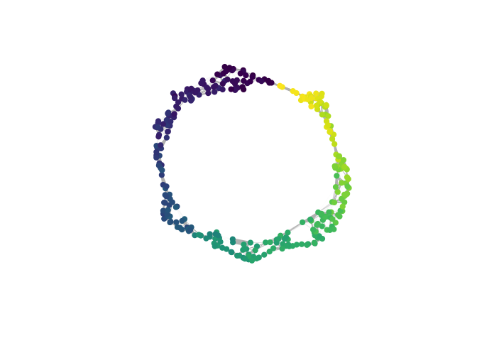

# CellREST - Cellular Relationships in Expression-state-based Single-cell Trees

- [Overview](#overview)
- [Installation Guide](#installation-guide)
- [CellREST Workflow](#cellREST-workflow)
- [References](#references)

## Overview

This repository includes the R package `CellREST` (**Cell**ular
**R**elationships in **E**xpression-state- based *S*ingle-cell
**T**rees) as introduced in “*Rethinking scRNA-seq trajectories in
phylogenetic paradigms: Overcoming challenges of missing ancestral
information*”.

It is compatible with a typical `Seurat` ([Hao et al.
2024](#ref-hao2024)) workflow to analyse single-cell RNA-sequencing
(scRNA-seq) data.

## Installation Guide

You can install the development version of `CellREST` R Package from
GitHub via R package
[`remotes`](https://cran.r-project.org/web/packages/remotes/index.html)

``` r
# if (!require("remotes", quietly = TRUE))
#    install.packages("remotes")
    
remotes::install_github("jn-goe/CellREST", dependencies = T)
```

CellREST depends on R Packages `ggplot2, ggtree, igraph, Seurat` and
imports
`pheatmap, ape, castor, dplyr, ggimage, magrittr, Rogue, scales, seqinr, treespace, uwot, viridis,pals`,
which are installed together with CellREST if `dependencies = T`.

We recommend to install `Rogue` and `treespace` prior to installing
CellREST. Dependency R Package
[`ggtree`](https://bioconductor.org/packages/release/bioc/html/ggtree.html)
has to be installed via
[`BiocManager`](https://www.bioconductor.org/install/).

For the below described CellREST workflow, we apply Adaptively
Thresholded Low-Rank Approximation (ALRA) ([Linderman et al.
2022](#ref-linderman2022)) imputation to the scRNA-seq data. ALRA is
implemented in the R Package `SeuratWrappers` and can be installed
following installation guidelines in the respective [GitHub
Repository](https://github.com/satijalab/seurat-wrappers).

For Maximum Likelihood tree reconstruction, IQ-TREE can be installed
locally or called via web servers following instructions on the [IQ-TREE
website](https://iqtree.github.io/). We provide the bash script
`run_iqtree.sh` to enable parallel tree reconstructions using multiple
threads (see example of use below). In all our analyses, we used IQ-TREE version
2 and hence called IQ-TREE via the `iqtree2` command. If you use another
version or command, please adapt it in `run_iqtree.sh`, accordingly. For
the below outlined exemplary workflow, IQ-TREE output files are readily
provided in the directory `toy_data`.

#### Requirements

We recommend to use `R` versions \>= 4.3.0. The CellREST package has
been tested for `R (v4.4.0)` and package versions
`ggplot2 (v3.5.1), ggtree (v3.12.0), igraph (v2.0.3), Seurat (v5.1.0), pheatmap (v1.0.12), ape (v5.8), castor (v1.8.2), dplyr (v1.1.4), ggimage (v0.3.3), magrittr (v2.0.3), Rogue (v2.1.6), scales (v1.3.0), seqinr (v4.2-36), treespace (v1.1.4.3), uwot (v0.2.3), viridis (v0.6.5), pals (v1.9), SeuratWrappers (v0.3.5)`
on macOS 15.5.

The runtime for the CellREST installation on a standard computer (16 GB
RAM) is around 25min and the workflow starting from IQ-TREE output files
as demonstrated below (314 cell scRNA-seq toy data) around 4min.

If you are have any issue during the installation or application of
CellREST please raise a repository
[issue](https://github.com/jn-goe/CellREST/issues).

## CellREST Workflow

Here we show the workflow of CellREST on a simulated scRNA-seq dataset,
in which cells are simulated to follow a simply cycle topology (via
`dyngen` ([Cannoodt et al. 2021](#ref-cannoodt2021)), see
[dynverse](https://dyngen.dynverse.org/index.html) for more details on
the simulation procedure). To simulate missing transient states, we
deleted cells in two disjunct simulation time intervals. First we
perform a typical downstream analysis, based on the R package `Seurat`:

``` r
library(CellREST)

data_dir <- "toy_data/cycle_simple_sub_ALRA_alra_300hvg_ACGTbinning_rateG4_pers01_fast"
obj <- readRDS("toy_data/cycle_simple_seurat_1SIM_subset_obj.RDS")

# cell-wise log-normalization
obj <- NormalizeData(obj)
# select highly variable genes (hvgs)
obj <- FindVariableFeatures(obj, nfeatures = 300)
# gene-wise scaling (hvgs)
obj <- ScaleData(obj)
# Principal Component Analysis (on hvgs)
obj <- RunPCA(obj)
# UMAP embedding for visualization
obj <- RunUMAP(obj, reduction = "pca", dims = 1:50)

# plot UMAP, cells color-coded by scaled simulation time
FeaturePlot(obj, feature = "sim_time_scaled") +
  NoAxes() + scale_color_viridis_c() + ggtitle("")
```


Subsequently, we use ALRA provided in R Package `SeuratWrappers` to
impute technical zeros:

``` r
library(SeuratWrappers)

# ALRA imputation of technical zeros
set.seed(123)
obj <- RunALRA(obj)
#> Rank k = 3
#> Identifying non-zero values
#> Computing Randomized SVD
#> Find the 0.001000 quantile of each gene
#> Thresholding by the most negative value of each gene
#> Scaling all except for 92 columns
#> 0.00% of the values became negative in the scaling process and were set to zero
#> The matrix went from 12.10% nonzero to 78.85% nonzero
#> Setting default assay as alra
```

As a first CellREST workflow step, we create the pseudo-alignment from
log-normalized scRNA-seq expression profiles:

``` r
# create and write pseudo-alignment
seurat_to_fasta(obj, 
                varf = VariableFeatures(obj, assay = "RNA"),
                pre = "cycle_simple_sub_RNA",
                dir = data_dir)
```

The FASTA file can now be input to IQ-TREE ([Minh et al.
2020](#ref-minh2020)) to reconstruct multiple single-cell-labeled
Maximum Likelihood trees (scML-trees). For consistency, we suggest to
fix the model via `-m GTR+F+G4`. For a parallized IQ-TREE call across 
multiple seeds, the following outlines an examplary use of the provided 
`run_iqtree.sh` bash script. Please adjust directories `OUTPUT_DIR` and `FASTA_FILE` 
as well as variables `MAX_PARALLEL_JOBS` and `N_CORES` according to your available computing capacities.
    
    source run_iqtree.sh
    export -f run_iqtree

    OUTPUT_DIR="output_directory"
    FASTA_FILE="directory_of_FASTA_file"

    N_REPLICATES=100                           # number of tree inferences
    SEEDS=$(seq 1 $N_REPLICATES)               # seeds for tree inferences

    MAX_PARALLEL_JOBS=$(($(nproc) - 10))       # maximal number of parallel jobs
    N_CORES=1                                  # number of cores per job

    MODEL="GTR+F+G4"                           # phylogenetic model
    FAST_STR="true"                            # fast tree inference
    PERS_VAL=0.1                               # pertubation strength
    LOG_FILE="$OUTPUT_DIR/iqtree_parallel.log" # combined LOG file directory

    printf "%s\n" "${SEEDS[@]}" | xargs -n 1 -P "$MAX_PARALLEL_JOBS" bash -c 'run_iqtree "$@"'
    _ "$OUTPUT_DIR" "$FASTA_FILE" "$MODEL" "$N_CORES" "$FAST_STR" "$PERS_VAL" "$LOG_FILE"

Another, slower option is to specify the number of successive tree reconstructions in the IQ-TREE
command via `--runs 100`. In this case, only one seed can be chosen and
reproducibility is only ensured if a number of cores `N_CORES` is
fixed:

    iqtree2 -s FASTA_FILE -m GTR+F+G4 -nt N_CORES -seed SEED -fast --runs 100

After all IQ-TREE runs are completed, trees and likelihoods can be
imported in R from the IQ-TREE output folder, which contains either 100
TREEFILES or one RUNTREES file:

``` r
res <- import_trees_lh(data_dir)
tree_list <- res$tree_list
```

R Package `ggtree` can help you to get a first brief visualization of an
exemplary scML-tree:

``` r
library(ggtree)

# choose one tree in tree list as example
tree <- tree_list[[100]]

# tree plot with simulation time based branch coloring
d <- data.frame(node=1:(tree$Nnode+length(tree$tip.label)),
                        color = c(obj$sim_time_scaled[tree$tip.label],
                                  rep(NA, tree$Nnode)))

(ggtree(tree, layout="equal_angle") %<+% d + aes(color=color)) +
  geom_tippoint() +
  scale_color_viridis_c(name = "simulated time - scaled") 
```


For further CellREST analyses, we however want to visualize all inferred
scML-trees and store them as PNGs, which will be the basis of
tree-embedding visualizations. The function
`tree_list_pngs(..., check_for_existing_PNGs = T)` checks, whether tree
PNGs are available in directory `dir_plots`. In this example, we provide
corresponding PNGs. However, new PNGs are created for
`check_for_existing_PNGs = F` or in case no PNGs are found in directory
`dir_plots`.

``` r
# make PNGS for all trees in tree list
png_list <- tree_list_pngs(obj = obj,
                           tree_list = tree_list,
                           col_by = "sim_time_scaled",
                           dir_plots = data_dir,
                           check_for_existing_PNGs = T, 
                           im_res = 50) 
```

Subsequently, tree-PCA or tree-UMAP plots can be created to visualize
variability between trees with respect to distance measures indicated
via `distance_measures`, here the patristic-correlation. If this
function exceeds available R cache resources, try to create new tree
PNGs with lower resolution (see above
`tree_list_pngs(..., im_res = 50)`).

``` r
tree_plots <- plot_tree_UMAP(obj = obj,
                            tree_list = tree_list,
                            png_list = png_list,
                            distance_measures = "patristic_correlation",
                            show_plot = TRUE,
                            title = "patristic correlation tree distances")
```


    #> [1] "patristic_correlation finished."

Finally, trees can be combined into a single-cell network (sc-network)
by transforming trees into nearest neighbor tree-graphs (nn-tree-graphs)
and computing their union.

``` r
obj <- make_knn_networks(obj = obj,
                         edge_length_representations = "min",
                         tree_list = tree_list,
                         k_dist = 4) # max_branch

network_all <- obj@misc$cellREST_igraph_obj
network_all
#> IGRAPH 888fab2 UNW- 314 1404 -- 
#> + attr: name (v/c), weight (e/n), min_length (e/n), min_branch_count
#> | (e/n)
#> + edges from 888fab2 (vertex names):
#>  [1] cell100 --cell1103 cell100 --cell1559 cell100 --cell169  cell100 --cell191 
#>  [5] cell1000--cell1630 cell1000--cell1765 cell1000--cell1864 cell1000--cell240 
#>  [9] cell1000--cell308  cell1000--cell486  cell1000--cell505  cell1000--cell515 
#> [13] cell1000--cell622  cell1000--cell667  cell1011--cell1219 cell1011--cell1336
#> [17] cell1011--cell1460 cell1011--cell1643 cell1011--cell1969 cell1011--cell217 
#> [21] cell1011--cell398  cell1011--cell544  cell1012--cell1018 cell1012--cell1854
#> [25] cell1012--cell260  cell1012--cell494  cell1012--cell571  cell1012--cell636 
#> + ... omitted several edges
```

For visualization of the network, we can either use already present
dimensionality reductions (see parameter `umap_key`). Here, however, we use
CellREST distances to compute a sc-network informed UMAP:

``` r
obj <- embed_network(obj = obj,
                     network = network_all,
                     umap_key = "network_umap", 
                     edge_length_attr = "min_length") # CellREST distance
distmat_graph <- obj@misc$cellREST_distmat

plot_network(obj = obj,
             network = network_all,
             umap_key = "network_umap",
             edge_width_factor = 3,
             col_by = "sim_time_scaled")
```


In this visualization we can observe network edges with longer lengths. For a
more detailed analysis, we visualize the distribution of logarithmized
edge lengths and edge weights. For the former, we can fit a normal
distribution to determine a threshold to detect potential outliers:

``` r
network <- prune_network(network = network_all,
                         quantile = 0.9999, 
                         pt.size = 2,
                         pt.alpha = .5)
```


Four edge lengths are larger than the theoretical 99.99% quantile of the
fitted normal distribution. Let’s visualize, where those outlier edges
are located in the UMAP:

``` r
edge.col_red <- (paste0(as_edgelist(network_all)[,1], as_edgelist(network_all)[,2]) %in%
                   paste0(as_edgelist(network)[,1], as_edgelist(network)[,2]))
edge.col_red <- c("darkred", "grey")[as.numeric(edge.col_red)+1]

obj <- embed_network(obj = obj,
                     network = network_all,
                     edge_length_attr = "min_length",
                     umap_key = "network_umap_min_length")

plot_network(obj = obj,
             network = network_all,
             umap_key = "network_umap_min_length",
             col_by = "sim_time_scaled",
             edge_width_factor = NULL, 
             edge_width_attr = 3,
             edge.color = edge.col_red)
```


Now, the pruned network after deleting the four outlier edges can be
plotted:

``` r
obj <- embed_network(obj = obj,
                     network = network,
                     edge_length_attr = "min_length",
                     umap_key = "network_umap_min_length")
plot_network(obj = obj,
               network = network,
               umap_key = "network_umap_min_length",
               col_by = "sim_time_scaled",
               edge_width_attr = "weight",
               edge_width_factor = 3)
```


The CellREST distance informed UMAP embedding does not change, since
removing the outlier edges had no effect on the CellREST distances.

We can also use other edge attributes to compute a shortest path
distance, e.g., the minimal number of branches connecting two cells.
This distance can be used for a UMAP embedding as following:

``` r
obj <- embed_network(obj = obj,
                     network = network,
                     umap_key = "network_umap_branch_count", 
                     edge_length_attr = "min_branch_count") 

plot_network(obj = obj,
             network = network,
             umap_key = "network_umap_branch_count",
             col_by = "sim_time_scaled",
             edge_width_attr = "weight",
             edge_width_factor = 3)
```



## References

<div id="refs" class="references csl-bib-body hanging-indent"
entry-spacing="0">

<div id="ref-cannoodt2021" class="csl-entry">

Cannoodt, Robrecht, Wouter Saelens, Louise Deconinck, and Yvan Saeys.
2021. “Spearheading Future Omics Analyses Using Dyngen, a Multi-Modal
Simulator of Single Cells.” *Nature Communications* 12 (1): 3942.
<https://doi.org/10.1038/s41467-021-24152-2>.

</div>

<div id="ref-hao2024" class="csl-entry">

Hao, Yuhan, Tim Stuart, Madeline H. Kowalski, Saket Choudhary, Paul
Hoffman, Austin Hartman, Avi Srivastava, et al. 2024. “Dictionary
Learning for Integrative, Multimodal and Scalable Single-Cell Analysis.”
*Nature Biotechnology* 42 (2): 293–304.
<https://doi.org/10.1038/s41587-023-01767-y>.

</div>

<div id="ref-linderman2022" class="csl-entry">

Linderman, George C., Jun Zhao, Manolis Roulis, Piotr Bielecki, Richard
A. Flavell, Boaz Nadler, and Yuval Kluger. 2022. “Zero-Preserving
Imputation of Single-Cell RNA-Seq Data.” *Nature Communications* 13 (1):
192. <https://doi.org/10.1038/s41467-021-27729-z>.

</div>

<div id="ref-minh2020" class="csl-entry">

Minh, Bui Quang, Heiko A Schmidt, Olga Chernomor, Dominik Schrempf,
Michael D Woodhams, Arndt von Haeseler, and Robert Lanfear. 2020.
“IQ-TREE 2: New Models and Efficient Methods for Phylogenetic Inference
in the Genomic Era.” *Molecular Biology and Evolution* 37 (5): 1530–34.
<https://doi.org/10.1093/molbev/msaa015>.

</div>

</div>
